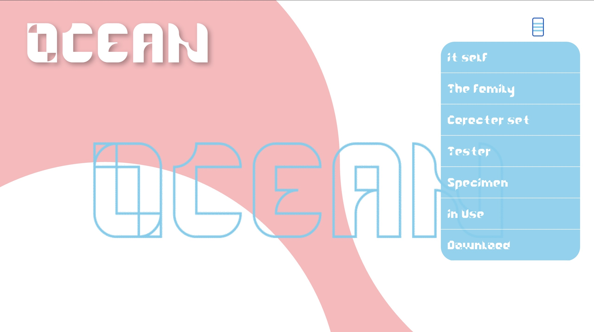
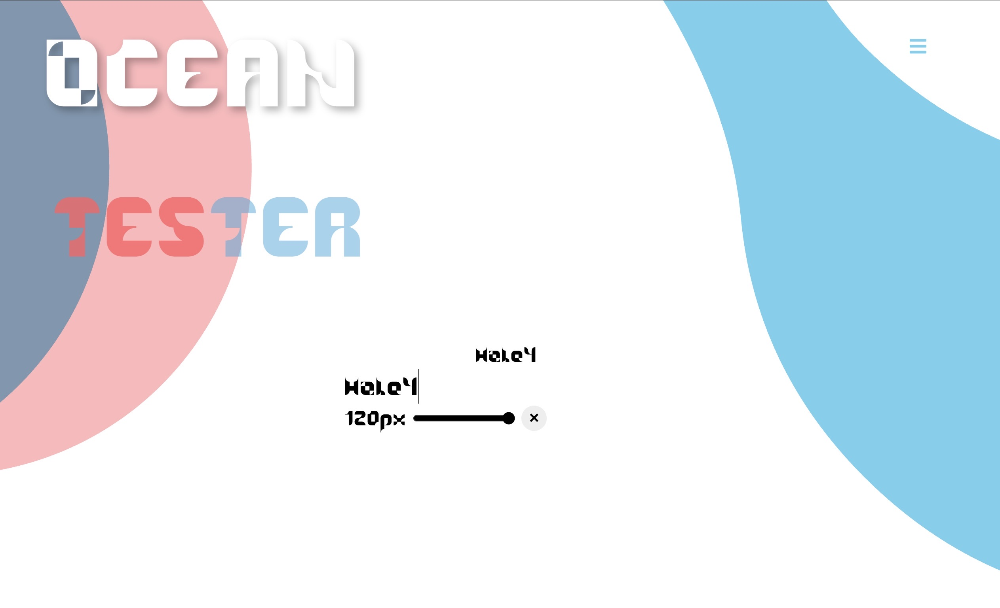
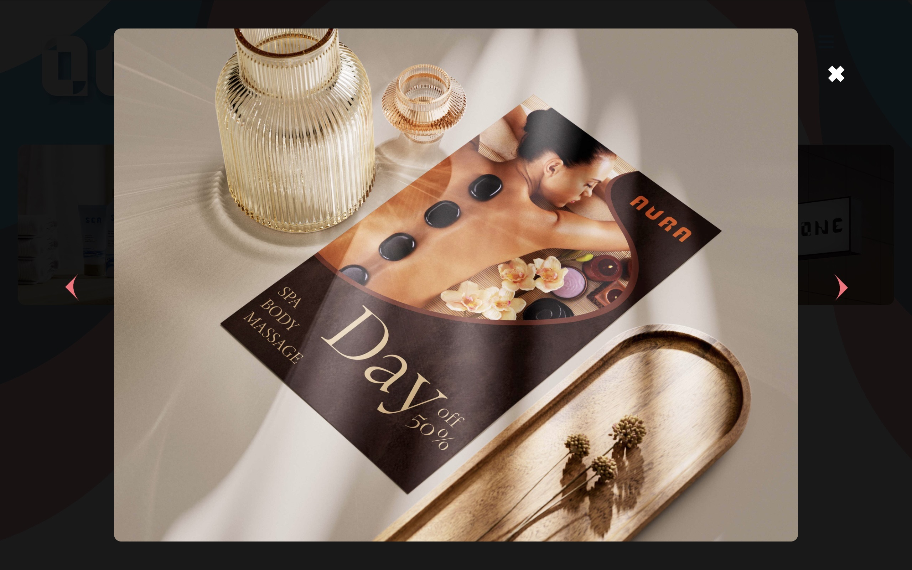

# OCEAN — Tipografia Modular

Aquest projecte forma part del projecte final del Grau Mitjà de Disseny Gràfic Interactiu, 
on es va demanar crear un microsite per promocionar una tipografia, amb la possibilitat 
que l'usuari pogués descarregar-la fàcilment.

A partir d'aquest encàrrec vaig crear **OCEAN**, una tipografia modular aplicada dins del 
microsite. El lloc web inclou una sèrie de mockups que mostren la tipografia en diversos 
productes, així com barres de testatge on l'usuari pot escriure i ajustar la mida en temps 
real, sliders, botons i elements audiovisuals (espècimen i GIFs) que presenten la tipografia 
en moviment. La web ha estat desenvolupada amb **HTML**, **CSS** i **JavaScript**, mentre 
que les il·lustracions i animacions s'han creat amb **After Effects** i **Adobe Animate**.

## **Demo en línia**
🔗 [Veure projecte](https://alumnesemad.cat/egea_anna/OCEAN/)

> [!WARNING]
> Aquesta microsite només és compatible amb escriptori (desktop)

## **Estructura de carpetes**
```text
OCEAN/
├── Memoria Final OCEAN.pdf
├── README.md
├── OCEAN/
│   ├── index.html
│   ├── javascript.js
│   ├── estils.css
│   ├── video/
│   │   ├── barras gift animado.webm
│   │   ├── barras gift animado.ogv
│   │   ├── Especimen.webm
│   │   ├── Especimen.mp4
│   │   └── Especimen.mov
│   ├── font-tester/
│   │   ├── index.html
│   │   ├── script.js
│   │   ├── style.css
│   │   └── fonts/
│   │       ├── ocean.woff
│   │       └── ocean.woff2
│   ├── galeria_instagram/
│   │   ├── index.html
│   │   ├── galeria.js
│   │   ├── galeria.css
│   │   └── img/
│   │       ├── Banner_world.jpg
│   │       ├── Flyer_Mockup_1.jpg
│   │       ├── GUM.jpg
│   │       ├── helado.jpg
│   │       ├── Let2.jpg
│   │       └── Mockup_Sea.jpg
│   ├── hamburguesa/
│   │   ├── index.html
│   │   ├── javascript.js
│   │   └── estils.css
│   ├── slider/
│   │   ├── index.html
│   │   ├── javascript_slider.js
│   │   ├── estils_slider.css
│   │   └── img_slider/
│   │       ├── Banner_world.jpg
│   │       ├── ABECEDARI ACCENS.png
│   │       └── ABECEDARI NORMAL.png
│   └── img/
│       ├── fondo.gif
│       ├── fons web.jpg
│       ├── ABECEDARI ACCENS.png
│       ├── ABECEDARI NORMAL.png
│       ├── background figuras.svg
│       └── fondo web.svg
```
## Decisions tècniques
- **Fons modular:** El fons del microsite està creat amb fragments dels mateixos mòduls que formen la tipografia OCEAN, mantenint una coherència visual total i reforçant l'estètica geomètrica de la font.

- **Cantonades arrodonides:** El disseny de la tipografia utilitza formes modulars amb cantonades arrodonides per mantenir l'estètica suau i fluida associada al nom OCEAN, garantint una identitat visual coherent i reconeixible.

- **Mockups temàtics:** Els mockups segueixen l'estètica del concepte OCEAN, amb colors, formes i composicions que evoquen moviment, fluïdesa i entorn marítim, reforçant la narrativa visual de la tipografia.

## Captures de pantalla


<br><br>

<br><br>


## Tecnologies utilitzades

#### Desenvolupament web


#### Disseny i animació


#### Maquetació de la memòria

